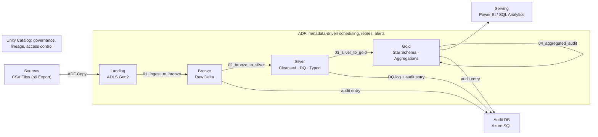

# Azure End-to-End Data Pipeline — o9 Forecast Medallion Architecture

A production-style data engineering project that ingests o9 supply-chain forecast data, processes it through a Bronze → Silver → Gold Medallion architecture on **Azure Databricks**, and serves analytics-ready tables with a full audit trail. Built with Delta Lake, PySpark, Azure Data Factory, Unity Catalog, Azure SQL, and Terraform IaC.

> This is a build-along spec, not a finished repo. Work through the phases in order. Each phase has acceptance criteria — don't move on until you can tick every box and explain *why* you did it that way. The "why" is what you'll be asked about in interviews.

---

## Why this project exists

Most portfolio pipelines stop at "read a CSV, write a Parquet." This one deliberately forces you through the parts that real data engineers get paid for and that interviewers actually probe:

- Metadata-driven orchestration where adding a new data subject requires zero code changes
- Multi-frequency ingestion (daily, weekly, monthly, quarterly) from a single parameterised pipeline
- Data quality enforcement with quarantine, audit logging, and pass-rate tracking
- Idempotent loads so re-runs never corrupt data
- A centralised audit trail across every layer, queryable from a single SQL database
- Dimensional modelling (star schema with SCD Type 2) for the serving layer
- Infrastructure as Code so the entire platform is reproducible in minutes

If you build this for real, you will be able to defend every design choice in an interview — which is the entire point.

---

## Architecture



A standalone image version lives at [`architecture.svg`](./architecture.svg) for use in slides or your portfolio.

**Flow in one line:** ADF checks for files, fetches metadata from SQL, runs four Databricks notebooks in sequence (raw ingest → cleanse → business model → KPI aggregation), and logs every batch to a central audit database — all triggered on four independent schedules, governed by Unity Catalog.

---

## Tech stack

| Layer | Technology |
|---|---|
| Orchestration | Azure Data Factory (ADF) — metadata-driven, parameterised pipeline |
| Storage | Azure Data Lake Storage Gen2 (ADLS) — landing, bronze, silver, gold, archive containers |
| Compute & processing | Azure Databricks, Apache Spark / PySpark |
| Storage format | Delta Lake — ACID transactions, schema enforcement, time travel |
| Metadata & audit | Azure SQL Database — pipeline audit, data quality log, pipeline metadata |
| Secrets | Azure Key Vault — connection strings and storage keys |
| Governance | Unity Catalog — catalogs, schemas, lineage, access grants |
| Modelling | Dimensional modelling — star schema, SCD Type 2 |
| Infrastructure | Terraform — full Azure resource provisioning via IaC |
| Language | Python (PySpark), SQL, JSON (ADF definitions) |
| Testing | pytest — unit tests for data quality and transformation functions |

---

## Dataset

**Source:** o9 Solutions supply-chain forecast exports — CSV files with pipe (`|`) delimiter, delivered across four frequencies: daily, weekly, monthly, and quarterly.

**Schema:** `product_id`, `location_id`, `forecast_date`, `forecast_qty`, `revenue_amount`, plus supporting categorical and free-text fields.

**Why this works:** the multi-frequency nature forces you to build a single parameterised pipeline that handles different schedules, table targets, and partition strategies from a configuration table rather than hard-coded notebooks. That metadata-driven pattern is what separates a pipeline you explain in ten minutes from one you defend for an hour.

---

## Repository structure

```
azure-data-pipeline/
├── README.md
├── infrastructure/
│   └── main.tf                         # Terraform: all Azure resources
├── conf/
│   └── pipeline_config.json            # Paths, table names, env params
├── databricks/
│   ├── notebooks/
│   │   ├── 00_config.py                # Centralised config: paths, schemas, helpers
│   │   ├── 01_ingest_to_bronze.py      # CSV ingestion → raw Delta
│   │   ├── 02_bronze_to_silver.py      # DQ, cleansing, schema enforcement
│   │   ├── 03_silver_to_gold.py        # Business transformation, star schema
│   │   └── 04_aggregated_audit.py      # KPI aggregation and transposed reporting
│   └── utilities/
│       ├── audit_helper.py             # Audit logging functions (write/mark-failed)
│       └── data_quality.py             # Reusable DQ validation functions
├── adf/
│   ├── pipeline/
│   │   └── pl_master_etl_pipeline.json # Master orchestration pipeline
│   ├── linkedservices/
│   │   ├── ls_adls_gen2.json
│   │   ├── ls_azure_databricks.json
│   │   ├── ls_azure_sql_audit.json
│   │   └── ls_keyvault.json
│   ├── datasets/
│   │   ├── ds_landing_csv.json
│   │   └── ds_adls_parquet.json
│   └── triggers/
│       ├── tr_daily_schedule.json      # 6:00 AM UTC
│       ├── tr_weekly_schedule.json     # Monday 7:00 AM UTC
│       ├── tr_monthly_schedule.json    # 1st of month 8:00 AM UTC
│       └── tr_quarterly_schedule.json  # 1st of quarter 9:00 AM UTC
├── data_model/
│   ├── 00_data_model_design.sql        # Architecture docs and design rationale
│   ├── 01_bronze_schema.sql
│   ├── 02_silver_schema.sql
│   └── 03_gold_schema.sql
├── sql/
│   ├── 01_audit_tables.sql             # Audit tables, DQ log, metadata, stored procs
│   └── 02_aggregation_views.sql        # Monitoring views for operators
└── tests/
    └── test_data_quality.py            # pytest: DQ functions, period derivation, aggregation
```

---

## Build phases

### Phase 0 — Environment setup

- Provision all Azure resources via **Terraform** (`infrastructure/main.tf`): resource group, ADLS Gen2 (5 containers), Azure SQL Database, Databricks workspace (Standard SKU), Data Factory, and Key Vault.
- Set up Unity Catalog: a catalog (`hpe_catalog`) with schemas `bronze`, `silver`, `gold`.
- Create the Azure SQL audit database schema: run `sql/01_audit_tables.sql` to create `audit.pipeline_audit`, `audit.data_quality_log`, and `audit.pipeline_metadata`.
- Seed `pipeline_metadata` with one row per data subject + frequency (daily, weekly, monthly, quarterly), including the null-check columns, partition column, group columns, and metric columns for each.
- Connect the Databricks workspace to your Git repo via Repos.

**Acceptance:** Terraform applies cleanly; you can run notebook `00_config.py` and see it resolve paths; a `SELECT * FROM audit.pipeline_metadata` returns four rows; Unity Catalog explorer shows `hpe_catalog.bronze`, `.silver`, `.gold` schemas.

### Phase 1 — Bronze: raw ingestion with full audit

- ADF pipeline `pl_master_etl_pipeline` performs a **Lookup** activity against `audit.pipeline_metadata` to fetch runtime config, then a **GetMetadata** to check whether files exist in the landing zone.
- **IfCondition** branches: if files exist, run notebook `01_ingest_to_bronze.py`; if not, write a `NO_DATA` audit entry and stop cleanly.
- Notebook reads CSV (pipe-delimited) with all columns as `STRING` — schema-on-read, no casting at this layer.
- Adds operational audit columns: `_file_name`, `_ingestion_ts`, `_source_batch_nr`, `_batch_id`, `_load_job_nr`, `_frequency`.
- Writes to `hpe_catalog.bronze.o9_forecast_raw` in **overwrite** mode — Bronze is always the full latest snapshot, not an accumulation.
- Archives source files to `archive/o9_forecast_{frequency}/{timestamp}/` post-load.
- Writes a `SUCCESS` or `FAILED` audit entry to `audit.pipeline_audit` (batch_id, src_count, tgt_count, duration).

**Acceptance:** running the pipeline twice with the same file produces the same Bronze row count (idempotent overwrite, not an append); a new file in landing is picked up on the next run; archive container shows the processed file; `audit.pipeline_audit` shows a new row with correct counts.

### Phase 2 — Silver: cleanse, conform, enforce quality

- Load metadata from SQL at runtime: which columns are null-check targets, what the partition column is.
- **NULL checks** on business keys (`product_id`, `location_id`, `forecast_date`): split records into valid and invalid sets.
- **Empty string → NULL** conversion across all STRING columns so downstream logic can use `IS NULL` reliably.
- **Type casting**: `forecast_date` to `DATE`, `forecast_qty` and `revenue_amount` to `DECIMAL`.
- Log data quality results to `audit.data_quality_log` — check type, pass count, fail count, pass rate.
- Append valid records to `hpe_catalog.silver.o9_forecast_ref` — Silver **accumulates history**, it never overwrites.
- Quarantine invalid rows (logged, not lost): error count tracked in the audit entry.

**Acceptance:** introducing a row with a null `product_id` in the source causes it to be excluded from Silver and logged in `data_quality_log` with check_type `NULL_CHECK`; re-running the same batch produces no new Silver rows (the audit entry shows the same counts); `vw_dq_summary` view shows the pass rate for each check.

### Phase 3 — Gold: dimensional model and KPI aggregation

- **Notebook 03 (silver_to_gold):** derives a `period` column (normalised to `YYYY-MM-01`) from `forecast_date` when `apply_concat = true` in metadata — so a row dated `2024-01-15` lands in period `2024-01-01` for clean monthly partitioning.
- Writes to `hpe_catalog.gold.o9_forecast_dmnsn` partitioned by `(period, _frequency)` in **overwrite** mode — Gold dimensions are always fully refreshed, never partially updated.
- Builds `dim_product`, `dim_location`, `dim_time` dimension tables with surrogate keys; `dim_product` and `dim_location` track changes via **SCD Type 2** (`valid_from`, `valid_to`, `is_current`).
- **Notebook 04 (aggregated_audit):** filters today's Gold data, groups by `file_name`, sums `forecast_qty` and `revenue_amount`, then **transposes** using `stack()` into `(file_name, keyfigure, total_qty_amount)` rows for a reporting-friendly format. Appends to `hpe_catalog.gold.o9_forecast_agg_audit`.

**Acceptance:** a query joining `o9_forecast_dmnsn` to `dim_product` and `dim_location` via surrogate keys returns the correct row count; `o9_forecast_agg_audit` has two rows per file (one for `forecast_qty`, one for `revenue_amount`); changing a product's attribute in Silver and re-running creates a new SCD2 version with the old one closed off (`is_current = false`).

### Phase 4 — Orchestration: schedules, retries, alerting

- ADF `pl_master_etl_pipeline` is fully parameterised on `data_subject` and `storage_account`, so one pipeline definition serves all four frequencies.
- Four triggers fire independently: `tr_daily_schedule` (6:00 AM UTC), `tr_weekly_schedule` (Monday 7:00 AM), `tr_monthly_schedule` (1st 8:00 AM), `tr_quarterly_schedule` (1st 9:00 AM). Each passes a different `data_subject` parameter.
- Notebook activities have **retries** (1–2 retries, 30–60 s interval) and **timeouts** (1–10 min per step) configured in the pipeline JSON.
- A failure in Silver halts Gold — Gold never runs against uncleansed data.

**Acceptance:** a forced failure in the Silver notebook (e.g., raise an exception) stops the Gold notebook from running and writes a `FAILED` entry to `audit.pipeline_audit`; the `vw_latest_pipeline_runs` view shows the failure; the daily trigger fires automatically the next morning without manual intervention.

### Phase 5 — Data quality framework and audit views

- Centralise reusable checks in `databricks/utilities/data_quality.py`: `validate_not_null()`, `validate_data_types()`, `validate_duplicates()`, `nullify_empty_strings()`, `log_dq_results()`. Each function is independently unit-testable.
- `audit_helper.py` encapsulates `write_audit_entry()` and `mark_audit_failed()` — every notebook calls these, never writes directly to SQL ad-hoc.
- SQL views in `sql/02_aggregation_views.sql` provide operator-facing monitoring: `vw_latest_pipeline_runs` (last 7 days), `vw_daily_load_summary` (success/failure counts, total rows, avg duration), `vw_dq_summary` (pass rates by table and check type), `vw_aggregated_audit` (KPI metrics from Gold).

**Acceptance:** `pytest tests/test_data_quality.py` passes all tests; `vw_dq_summary` shows a pass rate below 100% when you seed a bad row; `vw_daily_load_summary` shows the correct row and duration for today's run.

### Phase 6 — Governance and infrastructure hardening

- Apply Unity Catalog grants: a "read-only analyst" role can `SELECT` on Gold schemas but not Bronze or Silver.
- Confirm lineage graph in Unity Catalog shows Bronze → Silver → Gold for `o9_forecast_raw` → `o9_forecast_ref` → `o9_forecast_dmnsn`.
- Apply partition pruning on Silver (`_ingestion_date`) and Gold (`period`, `_frequency`) — validate with `EXPLAIN` that queries use partition filters.
- Run `OPTIMIZE` with `ZORDER BY (product_id, location_id)` on Gold after initial load; benchmark before/after file scan counts.
- All secrets (storage key, SQL connection string) reference Key Vault in the linked service definitions — no credentials in code or ADF JSON.

**Acceptance:** a user with analyst-only grants gets a permission error querying Bronze; the Unity Catalog lineage graph is a straight line Bronze → Silver → Gold; `DESCRIBE DETAIL hpe_catalog.gold.o9_forecast_dmnsn` shows the ZORDER columns; you can quantify the before/after improvement in files scanned.

---

## Design decisions

These are the choices to make deliberately and be ready to justify.

| Decision | What was chosen | Why |
|---|---|---|
| Storage format | Delta Lake over plain Parquet | ACID transactions, `MERGE`/upserts, schema enforcement, time travel — Parquet alone has none of these. |
| Orchestrator | Azure Data Factory over Databricks Workflows | ADF orchestrates across heterogeneous Azure services (ADLS file checks, SQL lookups, Databricks notebooks) in a single DAG; Workflows is tighter when all work is Databricks-only. |
| Metadata-driven config | Runtime lookup from `audit.pipeline_metadata` | Adding a new data subject or frequency requires a SQL `INSERT`, not a code change — the pipeline is the same for all variants. |
| Bronze write mode | Overwrite (full snapshot) | Bronze is a raw mirror of the source; appending would accumulate duplicates across re-runs. The archive container preserves the original files for replay. |
| Silver write mode | Append (historical accumulation) | Silver is the system of record — it must never lose cleansed history. Overwrites would destroy the audit trail. |
| Gold write mode | Overwrite for dimensions, append for agg_audit | Dimensions are fully refreshed on each run (SCD2 is handled explicitly); the aggregation audit table grows incrementally for trend reporting. |
| Idempotency | Overwrite for Bronze/Gold, append-by-batch_id for Silver | Re-running any notebook produces the same result — no duplicates, no gaps. Silver uses `batch_id` in the audit log to confirm a batch was already loaded. |
| Audit strategy | Centralised Azure SQL database | Every layer writes structured audit entries (batch_id, status, row counts, duration) to a single queryable store — no scattered log files. |
| DQ policy | Hard fail on null PKs, soft quarantine for type issues | Null primary keys are unrecoverable and must stop the pipeline; type mismatches can be isolated and investigated without blocking valid rows. |
| Secrets | Azure Key Vault references in linked services | No credentials in code, notebooks, or ADF JSON checked into source control. |
| Infrastructure | Terraform IaC | The entire platform can be torn down and recreated in minutes; no click-through provisioning that can't be reviewed or versioned. |

---

## Tradeoffs

Be honest about these in interviews — acknowledging tradeoffs is a senior signal.

- **ADF vs Databricks Workflows:** ADF adds a separate service to manage and its expression language is JSON-based and harder to test than Python. It earns its place here because the pipeline needs to check ADLS file existence and query SQL metadata *before* launching Databricks — that cross-service orchestration is where ADF excels. A Databricks-only shop would use Workflows and handle the file checks inside the notebooks.
- **Overwrite on Bronze vs append:** Overwriting Bronze means you lose the ability to query "what did the source look like three weeks ago" from the Delta table. The archive container partially compensates, but Delta time travel on Bronze would be richer. Overwrite was chosen to keep Bronze storage bounded and prevent the table from accumulating duplicate ingestions during development reruns.
- **Append on Silver vs MERGE:** Appending to Silver is simpler and performant, but it means querying Silver must always filter by `_batch_id` or `_ingestion_date` to avoid double-counting. A MERGE on the business key would be safer for analytical queries but adds SCD2-style complexity at the cleansing layer. Documented as a known limitation.
- **SCD Type 2 vs SCD Type 1 on dimensions:** Type 2 multiplies row counts and requires every fact query to join on `is_current = true` or a validity window. Type 1 is simpler and cheaper but destroys historical accuracy (what segment a product *was* at order time). Chosen Type 2 on dimensions where the history has analytical value.
- **Terraform vs ARM/Bicep:** Terraform is cloud-agnostic and has a richer ecosystem than ARM/Bicep, but adds a non-Azure toolchain dependency. ARM/Bicep would be a valid choice in a pure-Azure organisation with existing ARM skills.
- **Compute cost vs realism:** Development on a small single-node Databricks cluster (or Free Edition) keeps costs near zero but won't surface shuffle and skew problems that appear at production scale. Acknowledge this as a deliberate demo constraint.
- **Audit DB in Azure SQL vs Delta tables:** Storing audit data in Azure SQL gives you transactional writes and easy SQL tooling for monitoring. Storing it in Delta would keep everything in the lakehouse. SQL was chosen because audit writes are low-volume and transactional, not analytical — SQL's strengths, not Spark's.

---

## Data quality strategy

Centralise reusable checks in `databricks/utilities/data_quality.py`:

| Check | Function | Policy |
|---|---|---|
| Null / empty primary keys | `validate_not_null()` | **Hard fail** — invalid rows excluded, error count logged; if error rate exceeds threshold, halt the run |
| Type casting failures | `validate_data_types()` | **Soft quarantine** — bad rows isolated and logged, valid rows continue to Silver |
| Duplicate business keys | `validate_duplicates()` | **Soft quarantine** — keep latest record per key, log duplicates |
| Empty strings on nullable columns | `nullify_empty_strings()` | **Auto-correct** — replace `""` with `NULL` so downstream `IS NULL` checks are reliable |

Every check logs a row to `audit.data_quality_log` with `check_type`, `pass_count`, `fail_count`, and `pass_rate`. The `vw_dq_summary` view aggregates these for operator dashboards. Document your threshold policy (e.g., fail the run if `pass_rate < 0.95` on a null check) in `audit.pipeline_metadata`.

---

## What each piece demonstrates (interview map)

Use this to connect the work to the questions you'll be asked:

- ADF Lookup + IfCondition → "How do you make a pipeline metadata-driven?"
- ADF GetMetadata + NO_DATA path → "How do you handle missing source files gracefully?"
- Multi-frequency triggers → "How do you run the same pipeline on different schedules without duplicating code?"
- Bronze overwrite + archive → "How do you design an idempotent raw ingestion layer?"
- Silver append + null checks → "How do you enforce data quality without losing history?"
- SCD Type 2 on dimensions → "How do you track slowly changing attributes over time?"
- Gold overwrite + ZORDER → "How do you optimise query performance on a large fact table?"
- `stack()` transposition in aggregation → "How do you pivot data in PySpark without a fixed schema?"
- `audit.pipeline_audit` + views → "How do you make a pipeline observable?"
- Key Vault linked service → "How do you manage secrets in a production pipeline?"
- Terraform `main.tf` → "How do you provision cloud infrastructure repeatably?"
- `test_data_quality.py` → "How do you test a data pipeline?"

---

## How to deploy

1. **Provision infrastructure:** `cd infrastructure && terraform init && terraform apply` — creates resource group, ADLS, SQL, Databricks, ADF, Key Vault.
2. **Store secrets:** add the ADLS key and SQL connection string to Key Vault; update linked service JSON references to match your Key Vault name.
3. **Create audit schema:** connect to the Azure SQL Database and run `sql/01_audit_tables.sql` to create tables, stored procedures, and seed `pipeline_metadata`.
4. **Import Databricks notebooks:** upload `databricks/notebooks/` and `databricks/utilities/` to your Databricks workspace. Set the Unity Catalog to `hpe_catalog`.
5. **Import ADF resources:** publish the linked services, datasets, pipeline, and triggers from the `adf/` folder into your Data Factory instance.
6. **Configure linked services:** update `ls_adls_gen2.json`, `ls_azure_databricks.json`, and `ls_azure_sql_audit.json` with your workspace URLs and Key Vault name.
7. **Enable triggers:** activate the four ADF triggers (`tr_daily_schedule`, `tr_weekly_schedule`, `tr_monthly_schedule`, `tr_quarterly_schedule`).
8. **Run tests:** `pip install pyspark pytest && pytest tests/` — all tests should pass before your first production trigger fires.

---

## Future enhancements

- Add a **streaming Bronze path** (Structured Streaming from Event Hubs or Kafka) for near-real-time forecast updates alongside the batch files.
- Replace hand-rolled SCD2 logic with **Delta `MERGE`** on the dimension tables to make the upsert semantics explicit and auditable.
- Introduce **Delta Live Tables / Lakeflow** declarative pipelines and compare the maintainability against the current notebook approach.
- Add **expectations-based data observability**: freshness monitors (alert if Silver hasn't been updated in N hours), volume monitors (alert if row count drops > 20% vs prior run).
- Extend the **CI/CD pipeline** to run `pytest` on pull requests and deploy the ADF pipeline JSON to a dev factory automatically using the ADF CI/CD integration with GitHub Actions.
- Add **cost monitoring**: Databricks cluster policy to cap DBU consumption, plus a Terraform module for Azure Cost Management alerts.
