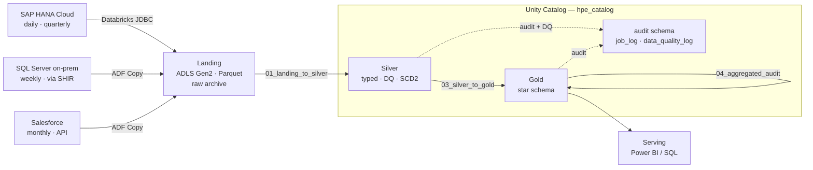

# Azure End-to-End Data Pipeline — o9 Forecast Medallion Architecture

A production-style data engineering project that extracts supply-chain forecast data from **SAP HANA Cloud**, an **on-premises SQL Server**, and **Salesforce**, then processes it through a landing → Silver → Gold medallion architecture on **Azure Databricks**, serving a surrogate-keyed star schema with a full audit trail.

Built with Delta Lake, PySpark, Azure Data Factory, ADLS Gen2, and Unity Catalog.

---

## Why this project exists

Most portfolio pipelines stop at "read a CSV, write a Parquet." This one deliberately covers the parts that real data engineers get paid for:

- **Metadata-driven orchestration** — adding a new data subject is a SQL `INSERT`, not a code change
- **Multi-source, multi-frequency ingestion** — three heterogeneous source systems on four independent schedules through one pipeline
- **Data quality with quarantine** — hard-fail and informational checks with separate policies, all logged
- **A shared-table medallion** — all four subjects share one Silver table and one fact table, scoped by partition
- **Dimensional modelling** — a periodic-snapshot fact with SCD Type 2 conformed dimensions
- **Centralised audit** — every layer of every run writes a queryable row with counts, status, and the ADF run id

---

## Architecture


```mermaid
flowchart LR
    HANA["SAP HANA Cloud<br/>daily · quarterly"]
    MSSQL["SQL Server on-prem<br/>weekly · via SHIR"]
    SFDC["Salesforce<br/>monthly · API"]

    LND["Landing<br/>ADLS Gen2 · Parquet<br/>raw archive"]
    SLV["Silver<br/>typed · DQ · SCD2"]
    GLD["Gold<br/>star schema"]
    AUD["audit schema<br/>job_log · data_quality_log"]
    BI["Serving<br/>Power BI / SQL"]

    HANA -->|Databricks JDBC| LND
    MSSQL -->|ADF Copy| LND
    SFDC -->|ADF Copy| LND

    LND -->|01_landing_to_silver| SLV
    SLV -->|03_silver_to_gold| GLD
    GLD -->|04_aggregated_audit| GLD
    GLD --> BI

    SLV -.audit + DQ.-> AUD
    GLD -.audit.-> AUD

    subgraph UC ["Unity Catalog — hpe_catalog"]
        SLV
        GLD
        AUD
    end
```

**Flow in one line:** `pl_extract_to_landing` reads config from Unity Catalog, fans out over the active data subjects, extracts each source to landing Parquet and updates its watermark, then calls `pl_master_etl_pipeline`, which runs three Databricks notebooks in sequence and logs every batch to the audit schema.

---

## Tech stack

| Layer | Technology |
|---|---|
| Orchestration | Azure Data Factory — two metadata-driven parameterised pipelines |
| On-prem connectivity | Self-hosted Integration Runtime (`shir-hpe-forecast`) |
| Storage | ADLS Gen2 — `landing`, `silver`, `gold`, `archive`, `unity-catalog` containers |
| Compute | Azure Databricks, PySpark |
| Storage format | Delta Lake — ACID, `MERGE`, `replaceWhere`, schema evolution, time travel |
| Governance | Unity Catalog — catalog, schemas, external locations, lineage |
| Metadata & audit | Unity Catalog Delta tables (`hpe_catalog.audit.*`) |
| Secrets | Databricks secret scope `hpe-forecast` |
| Modelling | Star schema — periodic snapshot fact, SCD Type 2 dimensions |
| Language | Python (PySpark), SQL, JSON (ADF definitions) |
| Testing | pytest |

> **Note on earlier revisions.** This project originally used Azure SQL for audit and metadata, Azure Key Vault for secrets, and CSV landing files. All three were removed: audit and config moved into Unity Catalog Delta tables, secrets moved to a Databricks secret scope, and landing moved to Parquet. Terraform IaC was likewise dropped in favour of CLI and REST deployment. The commit history records each of these migrations.

---

## Sources and data subjects

Four data subjects, each a row in `hpe_catalog.audit.pipeline_config`:

| Data subject | Source system | Extract method | Frequency | Full-load rows |
|---|---|---|---|---|
| `o9_forecast_daily` | SAP HANA Cloud | Databricks JDBC notebook | Daily 06:00 UTC | ~547,800 |
| `o9_forecast_quarterly` | SAP HANA Cloud | Databricks JDBC notebook | Quarterly 09:00 UTC | 600,000 |
| `o9_forecast_weekly` | SQL Server (on-prem) | ADF Copy via SHIR | Mondays 07:00 UTC | ~390,000 |
| `o9_forecast_monthly` | Salesforce | ADF Copy (`SalesforceV2Source`) | 1st monthly 08:00 UTC | ~390,000 |

Full load covers Jul 2020 – Jun 2025; incremental deltas run Jul 2025 onward at roughly 8–10k rows per run, driven by a high-watermark column per subject.

**Common schema:** `product_id`, `location_id`, `forecast_date`, `forecast_qty`, `revenue_amount`, plus `customer_id`, `channel`, `category`, `sub_category`, `region`, `country`, `currency`, `uom`.

> SAP HANA is read through a Databricks JDBC notebook rather than an ADF Copy activity. The ADF SAP HANA connector needs an ODBC driver with TLS support, and SAP only distributes `HDB_CLIENT_NO_CRYPTO` for Windows without a paid support contract. The JVM handles TLS natively, so `ngdbc.jar` sidesteps the problem entirely.

---

## Repository structure

```
azure-forecast-project/
├── adf/
│   ├── pipeline/
│   │   ├── pl_extract_to_landing.json     # Source → landing Parquet, per connector
│   │   └── pl_master_etl_pipeline.json    # Landing → Silver → Gold
│   ├── linkedService/                     # ADLS, Databricks, HANA, SQL Server, Salesforce
│   ├── dataset/                           # Landing Parquet, source tables/objects
│   ├── integrationRuntime/shir_onprem.json
│   └── trigger/                           # Four independent schedules
├── databricks/
│   ├── notebooks/
│   │   ├── 00_config.py                   # Catalog, paths, secrets, config lookup
│   │   ├── 00_get_metadata.py             # Returns active config rows to ADF
│   │   ├── 00_update_watermark.py         # Advances the incremental watermark
│   │   ├── 01_ingest_hana_to_landing.py   # SAP HANA via JDBC → landing Parquet
│   │   ├── 01_landing_to_silver.py        # Harmonize, DQ, type cast, SCD2 merge
│   │   ├── 03_silver_to_gold.py           # Dimensions, surrogate keys, fact
│   │   └── 04_aggregated_audit.py         # KPI aggregation and transposition
│   └── utilities/
│       ├── transformations.py             # Transform strategies + SCD2 merges
│       ├── dq_checks.py                   # DQ check strategies + runner
│       ├── audit_helper.py                # Audit and DQ logging
│       └── data_quality.py
├── data_model/
│   ├── 02_silver_schema.sql               # Silver tables + quarantine
│   ├── 03_gold_schema.sql                 # Star schema + v_forecast_star view
│   ├── 04_audit_schema.sql
│   └── 05_pipeline_config.sql             # Config table + seed rows
├── sql/                                   # Source-system seed and delta scripts
├── salesforce/                            # SFDX object metadata + data generators
├── tests/test_data_quality.py
└── docs/
```

---

## The medallion layers

### Landing — the raw archive

Landing Parquet is the raw layer. There is no Bronze Delta table: landing holds untransformed source Parquet and is copied to the `archive` container after every load, so it already serves the raw-archive role the medallion pattern assigns to Bronze — reprocessing re-reads landing and never touches the source systems. A separate Bronze table would have been a second copy of the same data, adding a hop without adding a guarantee.

Landing is a **rolling window**, not the history. After a successful load the consumed files are archived under `archive/<data_subject>/<load_job_nr>/` and cleared from landing; the archive keeps the history. The clear only removes the files that run actually consumed, so a file dropped mid-run survives to the next cycle.

### Silver — `hpe_catalog.silver.o9_forecast_ref`

`01_landing_to_silver` does harmonize → structural DQ → type cast → domain DQ → SCD2 merge in one pass.

- Normalises column names to lowercase (HANA returns uppercase; Salesforce carries `__c` suffixes) and adds `_file_name`, `_ingestion_ts`, `_frequency`, `_load_job_nr`, `_batch_id`
- Runs `NullPKCheck` and `DedupCheck` **on raw strings, before casting**, routing failures to `silver.quarantine` with a `_dq_fail_reason`. The ordering is deliberate — a malformed date is quarantined as a bad value rather than silently becoming `NULL` and failing a null check for the wrong reason
- Empty strings → `NULL`, then casts `forecast_date` to `DATE` and the two measures to `DECIMAL`
- Runs `DomainCheck` on `category` and `currency` **after casting** — informational only, rows are kept and the violation is logged
- Applies a **two-pass SCD Type 2 merge** on the six-column business grain
- Writes a period roll-up to `silver.o9_forecast_period_agg`
- Partitioned by `_ingestion_date`

All four subjects share this table, scoped by `_frequency`.

### Gold — star schema

| Table | Type | Notes |
|---|---|---|
| `dim_product` | SCD Type 2 | `product_sk = sha2(product_id ‖ effective_from)` |
| `dim_location` | SCD Type 2 | `location_sk = sha2(location_id ‖ effective_from)` |
| `dim_time` | Insert-only | A calendar date's attributes never change |
| `fact_forecast` | Periodic snapshot | Partitioned by `period`, `_frequency` |
| `v_forecast_star` | View | Rejoins the star for ad-hoc queries |

The fact grain is one row per product / location / date / channel / customer / frequency. Because a forecast is an estimate that gets **restated** rather than an event that accumulates, each run rebuilds its own slice with `replaceWhere _frequency = '<freq>'`, leaving the other three subjects untouched.

### Aggregated audit

`04_aggregated_audit` reads `v_forecast_star` filtered to the current batch, aggregates by period / frequency / category / region, then transposes the measures into `(keyfigure, kpi_value)` rows using `stack()` built dynamically from the metric list.

If the passed `batch_id` matches zero rows it **fails loudly** rather than reporting success — a wiring error that reports green is worse than one that stops the pipeline.

---

## Design decisions

| Decision | Choice | Rationale |
|---|---|---|
| Storage format | Delta over plain Parquet | ACID, `MERGE`, `replaceWhere`, schema evolution, time travel. The SCD2 logic is impossible without atomic upserts. |
| Metadata store | Unity Catalog Delta, not Azure SQL | Removes a service, an identity, and a JDBC dependency. Config lives beside the data it governs. |
| Config-driven pipeline | Runtime lookup from `pipeline_config` | A new data subject is one `INSERT` plus a trigger — no notebook change, no redeploy. |
| Shared Silver / fact tables | One table, partitioned by `_frequency` | All four subjects share a business grain. Four physical tables would mean a `UNION ALL` in every downstream query. |
| No Bronze layer | Landing Parquet is the raw archive | Landing is immutable and archived after every load, so it already guarantees reprocessing without re-reading the sources. A Bronze Delta table would duplicate it. |
| Silver write mode | Two-pass SCD2 `MERGE` | Silver is the system of record; attribute history has analytical value. |
| Gold fact write mode | `replaceWhere` on `_frequency` | The fact is a periodic snapshot — a restatement must replace, not accumulate. A plain overwrite would drop the other three subjects. |
| Surrogate keys | `sha2(natural_key ‖ effective_from)` | Deterministic and reproducible, so a dimension rebuild does not orphan the fact. Identity columns are order-dependent and need cross-executor coordination. |
| DQ policy | Hard-fail PK/dedup, informational domain | A null business key is unrecoverable. An unexpected currency is often a legitimately new value — flag it, don't drop it. |
| Secrets | Databricks secret scope | No credentials in code, notebooks, or the ADF JSON in Git. |
| HANA extraction | Databricks JDBC, not ADF Copy | SAP's free Windows client ships without a TLS crypto library; the JVM handles TLS natively. |

### Design patterns

Transformations and DQ checks are both implemented as the **Strategy pattern** — every transform implements `apply(df) -> df` and every check implements `run(df) -> (valid_df, invalid_df, result)`. Notebooks compose a list and hand it to a runner:

```python
enriched_df = apply_transforms(raw_df, [
    AddAuditColumnsTransform(frequency=frequency, load_job_nr=load_job_nr, batch_id=batch_id),
    StandardizeTransform(upper_cols=["category"]),
])
```

Adding a transform or a check is a new class. The notebooks never change, and each strategy is unit-testable without Spark orchestration.

---

## Known tradeoffs and limitations

Stated plainly, because they are real:

- **Dead ADF assets.** `ls_azure_sql_audit.json`, `ls_keyvault.json`, `ds_azure_sql_metadata.json`, and `ds_landing_csv.json` remain in `adf/` from earlier revisions and are referenced by no active pipeline.
- **The fact loses forecast-evolution history.** A periodic snapshot keeps only the current estimate. Silver's SCD2 retains the history, but answering "what did we forecast last month?" from Gold would need a snapshot date added to the fact grain.
- **Over-partitioned for the data volume.** At roughly 2M rows, partitioning by `period` and `_frequency` produces partitions far below the ~1GB rule of thumb. `_frequency` alone plus `ZORDER` on the high-cardinality columns would suit the current scale; the current layout anticipates production volume.
- **`get_pipeline_metadata` interpolates SQL.** The value comes from an ADF parameter rather than user input, so the risk is low, but a parameterised read or an allowlist would be the better default.
- **Row counts trigger extra jobs.** Several `.count()` calls exist mainly for logging. Caching before multiple actions, or reading Delta's `DESCRIBE HISTORY` operation metrics, would avoid the recomputation.
- **The Salesforce full load is partial.** ~84,000 of 108,000 records loaded; a Developer Edition org caps at 10MB of storage. The pipeline handled the partial load correctly and the audit counts reflect exactly what arrived.
- **Demo-scale compute.** A single-user cluster over ~2M rows will not surface the shuffle-skew and spill problems that appear at production scale. A deliberate cost constraint, not a claim about scale.

---

## Deployment

Full step-by-step commands are in [DEPLOYMENT_GUIDE.md](DEPLOYMENT_GUIDE.md).

1. **Provision Azure resources** — resource group, ADLS Gen2 with the six containers, Databricks workspace, Data Factory.
2. **Set up Unity Catalog** — create an Access Connector, grant it Storage Blob Data Contributor, create the storage credential and external location, then `CREATE CATALOG hpe_catalog MANAGED LOCATION 'abfss://unity-catalog@…'`.
3. **Create the schemas** — run `data_model/02`–`05` in order. `05_pipeline_config.sql` seeds the four data-subject rows.
4. **Create secrets** — `databricks/secrets_setup.sh` populates the `hpe-forecast` scope: ADLS account name and key, SAP HANA / SQL Server / Salesforce credentials, and the service principal used for the ADLS OAuth mount.
5. **Install the HANA JDBC driver** — upload `ngdbc.jar` to the cluster. Requires **Single User** access mode; Unity Catalog's artifact allowlist blocks JAR installs on Shared clusters unless a metastore admin adds an entry.
6. **Register the SHIR** — install the Self-hosted Integration Runtime on the machine with SQL Server access and register it with the auth key from ADF.
7. **Import Databricks notebooks** via Repos, then **deploy the ADF resources** (linked services, datasets, IR, pipelines, triggers).
8. **Seed the source systems** — `sql/04`–`06` for HANA and SQL Server, `salesforce/generate_full_load.py` for Salesforce.
9. **Run tests** — `pip install pyspark pytest && pytest tests/`.
10. **Enable the four triggers.**

To re-run the medallion from scratch, `sql/10_reset_medallion.sql` clears all four subjects' Silver state and drops Gold so the dimensions rebuild.

---

## Operational notes

Every layer of every run writes a row to `hpe_catalog.audit.job_log`:

```sql
SELECT layer, status, records_inserted, records_updated, error_records, error_message
FROM   hpe_catalog.audit.job_log
WHERE  run_id = '<adf-run-id>'
ORDER  BY insert_time;
```

Batch ids are prefixed by stage (`silver_…`, `gold_…`, `agg_…`), so a failing row names its own layer. Failures are wrapped so the audit entry is written **before** the exception re-raises — ADF sees the failure and the diagnostic row still exists.

DQ pass rates come from `hpe_catalog.audit.data_quality_log`, which records checked / passed / failed counts per check per batch.

Within `pl_master_etl_pipeline`, each notebook depends on its predecessor succeeding, so a Silver failure prevents Gold from ever running against uncleansed data.

---

## Future enhancements

- Idempotency guard on the Silver load, keyed on `job_log`
- `OPTIMIZE … ZORDER BY (product_id, location_id)` on the fact, plus scheduled `VACUUM`
- Broadcast the dimension tables in the Gold join — they are small enough to eliminate that shuffle entirely
- Freshness and volume monitors (alert when a layer has not loaded in N hours, or row count drops more than 20% against the prior run)
- CI: run `pytest` on pull requests and deploy the ADF JSON to a dev factory via GitHub Actions
- A streaming landing path via Auto Loader for near-real-time forecast updates