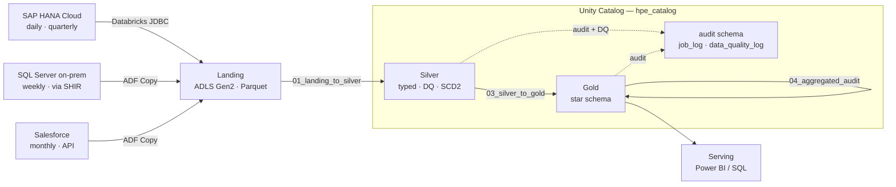

# Technical Specification
## o9 Forecast Data Pipeline — Azure Medallion Architecture

**Status:** as-built
**Catalog:** `hpe_catalog`
**Layers:** landing → silver → gold

---

## 1. Purpose

Extract supply-chain forecast data from three heterogeneous source systems, cleanse and
conform it, and serve a surrogate-keyed star schema with a queryable audit trail.

The pipeline is config-driven: four data subjects run through the same two ADF pipelines
and the same four Databricks notebooks. Adding a fifth is an `INSERT` into
`hpe_catalog.audit.pipeline_config` plus a trigger — no notebook change, no redeploy.

---

## 2. Scope

| In scope | Out of scope |
|---|---|
| Batch extraction from SAP HANA Cloud, on-prem SQL Server, Salesforce | Streaming / real-time ingestion |
| Landing (Parquet) → Silver (typed, SCD2) → Gold (star schema) | Reverse ETL back to source systems |
| Data quality with quarantine and a DQ log | ML forecasting models |
| Job and DQ audit in Unity Catalog Delta tables | Power BI report authoring |
| Config-driven orchestration in Azure Data Factory | Multi-region DR |

---

## 3. Architecture Overview

### 3.1 Why there is no Bronze layer

The medallion pattern assigns Bronze the role of an immutable raw archive, so that
reprocessing never has to re-read the source systems. In this pipeline the **landing
container already fills that role**: it holds untransformed source Parquet, and every
load copies it to the `archive` container. The Bronze Delta table was an additional
physical copy of the same bytes that added no guarantee the landing zone did not already
provide.

It was removed in commit `654f3b3`. `01_ingest_to_bronze` and `02_bronze_to_silver` were
merged into a single `01_landing_to_silver` notebook that harmonizes column names, runs
structural DQ on raw strings, type casts, runs domain DQ, and merges into Silver.

`pipeline_config.bronze_table` is retained as a nullable, unused column so pre-existing
config rows stay loadable. Nothing reads it.

---

## 4. Technology Stack

| Concern | Technology |
|---|---|
| Orchestration | Azure Data Factory — `pl_extract_to_landing`, `pl_master_etl_pipeline` |
| On-prem connectivity | Self-hosted Integration Runtime (`shir-hpe-forecast`) |
| Storage | ADLS Gen2 — `landing`, `silver`, `gold`, `archive`, `unity-catalog` |
| Compute | Azure Databricks (PySpark) |
| Format | Delta Lake — ACID, `MERGE`, `replaceWhere`, schema evolution, time travel |
| Governance | Unity Catalog — catalog, schemas, external locations, lineage |
| Config & audit | Unity Catalog Delta (`hpe_catalog.audit.*`) |
| Secrets | Databricks secret scope `hpe-forecast` |
| Testing | pytest |

**Deliberately not used.** Azure SQL (audit and config moved into Unity Catalog Delta),
Azure Key Vault (secrets moved to a Databricks secret scope), and Terraform (deployment
is CLI + REST). Earlier revisions used all three; the commit history records each
migration.

---

## 5. Source Systems

### 5.1 SAP HANA Cloud — daily, quarterly

- Schema `O9_SOURCE`; objects `FORECAST_VIEW` (daily) and `FORECAST_QUARTERLY`.
- Extracted by the **`01_ingest_hana_to_landing` Databricks notebook over JDBC**, not by
  an ADF Copy activity.
- Watermark column: `CHANGED_ON`.

> **Why JDBC and not the ADF connector.** The ADF SAP HANA connector requires an ODBC
> driver with TLS support. SAP distributes only `HDB_CLIENT_NO_CRYPTO` for Windows
> without a paid support contract, and that build cannot negotiate TLS to HANA Cloud.
> The JVM handles TLS natively, so `ngdbc.jar` on the Databricks cluster sidesteps the
> problem. The JAR install requires **Single User** cluster access mode — Unity
> Catalog's artifact allowlist blocks JAR installs on Shared clusters unless a metastore
> admin adds an allowlist entry.

### 5.2 SQL Server (on-premises) — weekly

- Database `HPE_SOURCE`, schema `dbo`, table `Forecast`.
- Extracted by **ADF Copy** through the self-hosted IR.
- Watermark column: `modified_dt`.

### 5.3 Salesforce — monthly

- Object `HPE_Forecast_Monthly__dll` (Data Cloud DLO).
- Extracted by **ADF Copy** using the Salesforce connector.
- Watermark column: `LastModifiedDate`.
- Seeded by `salesforce/generate_full_load.py` via the Data Cloud Ingestion API.

> **Known constraint.** The Developer Edition org caps at 10 MB of storage, so the full
> load lands roughly 84,000 of 108,000 records. The pipeline handles the partial load
> correctly and the audit counts reflect exactly what arrived. Do not read a short row
> count for the monthly subject as a failure.

---

## 6. Data Model

### 6.1 Common source schema

All three sources produce the same business columns:

`product_id`, `location_id`, `forecast_date`, `forecast_qty`, `revenue_amount`,
`customer_id`, `channel`, `category`, `sub_category`, `region`, `country`, `currency`,
`uom`.

### 6.2 Layer contracts

| Layer | Format | Typing | Write mode | Guarantee |
|---|---|---|---|---|
| Landing | Parquet | Source types | Overwrite per extract | Untransformed source bytes; copied to `archive` |
| Silver | Delta | Fully typed | Two-pass SCD2 `MERGE` | System of record; attribute history retained |
| Gold | Delta | Fully typed | `replaceWhere` on `_frequency` | Current restated forecast, surrogate-keyed |

Silver is `hpe_catalog.silver.o9_forecast_ref`, partitioned by `_ingestion_date`, shared
by all four subjects and scoped by `_frequency`.

### 6.3 Star schema

| Table | Type | Key |
|---|---|---|
| `dim_product` | SCD Type 2 | `product_sk = sha2(product_id ‖ effective_from)` |
| `dim_location` | SCD Type 2 | `location_sk = sha2(location_id ‖ effective_from)` |
| `dim_time` | Insert-only | `date_key` (natural date key, never versioned) |
| `fact_forecast` | Periodic snapshot | Partitioned by `period`, `_frequency` |
| `v_forecast_star` | View | Rejoins fact to all three dimensions |

**Fact grain:** one row per product / location / forecast_date / channel / customer /
frequency. Measures `forecast_qty` and `revenue_amount` are additive across every
dimension. Descriptive attributes live only in the dimensions; the fact carries
surrogate keys plus the natural keys retained for lineage and reconciliation.

**Expected dimension cardinality after a clean load:** `dim_product` = **500** rows,
`dim_location` = **200** rows. These two numbers are the fastest proof that the seed data
is keyed correctly (see §7.6).

---

## 7. Design Decisions

### 7.1 Landing as the raw archive
Landing Parquet plus the archive container provides the reprocessing guarantee Bronze
would have. See §3.1.

### 7.2 Deterministic surrogate keys
`sha2(natural_key ‖ effective_from)` rather than an identity column. Identity values are
order-dependent and need cross-executor coordination; a deterministic hash survives a
full warehouse rebuild without orphaning the fact, and is stable across environments.

### 7.3 Periodic snapshot fact with `replaceWhere`
A forecast is an estimate that gets **restated**, not an event that accumulates. Each run
rebuilds only its own slice with `replaceWhere _frequency = '<freq>'`, leaving the other
three subjects untouched. A plain overwrite would drop them.

### 7.4 Shared Silver and fact tables
All four subjects share one business grain, so they share one Silver table and one fact
table, partitioned by `_frequency`. Four physical tables would force a `UNION ALL` into
every downstream query.

### 7.5 Config-driven orchestration
Runtime config is read from `hpe_catalog.audit.pipeline_config` by the
`00_get_metadata` notebook and returned to ADF. No JDBC, no Azure SQL.

### 7.6 Dirty data by design
The seed scripts inject deliberate violations so the DQ layer has something to catch:
unknown categories (`HARDWARE`, `UNKNOWN`, `MISC`) and an invalid currency (`XYZ`).

These overrides are keyed to `rn % 100` while the clean category is keyed to
`(rn % 500) % 7`. Because 100 divides 500, a product's index fully determines whether it
hits the dirty branch — every row for a given product gets the same category, so the
override produces no SCD2 churn.

That property matters. Before commit `13c81a3`, `category` was keyed to `rn % 7` while
`product_id` came from `rn % 500`. Those are coprime, so each product cycled through all
seven categories, Gold read every load as a genuine SCD2 attribute change, and the
dimensions churned indefinitely — `dim_product` reached 1,354 rows for 500 products and
the star view fanned out to 1,016,171 rows against 542,322 facts, overstating every KPI.
Dimension attributes are now derived from the same expression that builds the key:
category and sub_category from `(row % 500)`, region and country from `(row * 7) % 200`.
Currency stays row-keyed — it is a fact attribute, not a dimension.

### 7.7 Quarantine vs informational DQ
Structural failures (null PK, duplicates) are unrecoverable and route rows to quarantine.
Domain failures (unexpected category or currency) are often a legitimately new value, so
rows are kept and the violation is logged instead.

---

## 8. Security

- All credentials resolve from the Databricks secret scope `hpe-forecast`. No secret
  appears in a notebook, in SQL, or in the ADF JSON committed to Git.
- ADLS access uses a service principal via OAuth; the account key is scope-held.
- Unity Catalog governs table-level access. Analysts are granted `SELECT` on
  `hpe_catalog.gold` only.
- The self-hosted IR keeps on-prem SQL Server traffic off the public internet.

**Known weakness.** `get_pipeline_metadata()` in `00_config.py` interpolates
`data_subject` directly into a SQL string. The value originates from an ADF pipeline
parameter rather than user input, so exposure is low, but a parameterised read or an
allowlist would be the better default.

---

## 9. Data Quality Framework

Checks are implemented as the **Strategy pattern** in `databricks/utilities/dq_checks.py`.
Every check implements `run(df) -> (valid_df, invalid_df, result)`; notebooks compose a
list and hand it to `run_dq_checks()`. Adding a check is a new class, not a notebook edit.

| Check | Class | Policy | Stage |
|---|---|---|---|
| Null / empty PK | `NullPKCheck` | **Quarantine** — rows removed | Structural (pre-cast) |
| Duplicate business key | `DedupCheck` | **Quarantine** — keeps latest per PK + frequency | Structural (pre-cast) |
| Category domain | `DomainCheck` | **Informational** — rows kept, violation logged | Post-cast |
| Currency domain | `DomainCheck` | **Informational** — rows kept, violation logged | Post-cast |

Structural checks run against raw strings *before* type casting, so a malformed value
cannot fail a cast before the DQ layer has had a chance to describe it.

Every check writes a row to `hpe_catalog.audit.data_quality_log` with `check_type`,
`records_checked`, `records_passed`, and `records_failed`, keyed to the run's `batch_id`.

Valid domains are defined in `00_config.py`:

- `VALID_CATEGORIES` — `SERVER`, `STORAGE`, `COMPUTE`, `NETWORKING`, `PRIVATE_CLOUD`, `SUPERCOMPUTING`, `AI`
- `VALID_CURRENCIES` — `USD`, `EUR`, `GBP`, `JPY`, `INR`, `SGD`, `AED`, `BRL`, `CAD`, `AUD`

---

## 10. Audit Framework

`hpe_catalog.audit.job_log` — one row per layer per run:

| Column | Meaning |
|---|---|
| `batch_id` | Stage-prefixed identifier (`silver_…`, `gold_…`, `agg_…`) |
| `layer` | `silver` / `gold` / `agg_audit` |
| `status` | `SUCCESS` / `FAILED` |
| `records_inserted` / `records_updated` / `error_records` | Row counts |
| `object_name` | Target Delta table |
| `error_message` | Exception text on failure, `NULL` on success |
| `run_id` | ADF pipeline run ID |

Failures are wrapped so the audit entry is written **before** the exception re-raises:
ADF sees the failure and the diagnostic row still exists.

`04_aggregated_audit` fails loudly when its `batch_id` matches zero rows, listing the
batch ids actually present. A wiring error that reports green is worse than one that
stops the pipeline.

---

## 11. Known Limitations

- **The fact loses forecast-evolution history.** A periodic snapshot keeps only the
  current estimate. Silver's SCD2 retains it; answering "what did we forecast last
  month?" from Gold would need a snapshot date added to the fact grain.
- **Over-partitioned for the volume.** At ~2M rows, partitioning by `period` and
  `_frequency` yields partitions far below the ~1GB rule of thumb. `_frequency` alone
  plus `ZORDER` would suit current scale; the layout anticipates production volume.
- **Row counts trigger extra jobs.** Several `.count()` calls exist mainly for logging.
  Caching before multiple actions, or reading Delta's `DESCRIBE HISTORY` operation
  metrics, would avoid recomputation.
- **Dead ADF assets.** `ls_azure_sql_audit.json`, `ls_keyvault.json`,
  `ds_azure_sql_metadata.json`, and `ds_landing_csv.json` remain in `adf/` from earlier
  revisions and are referenced by no active pipeline.
- **Demo-scale compute.** A single-user cluster over ~2M rows will not surface the
  shuffle-skew and spill problems that appear at production scale.
